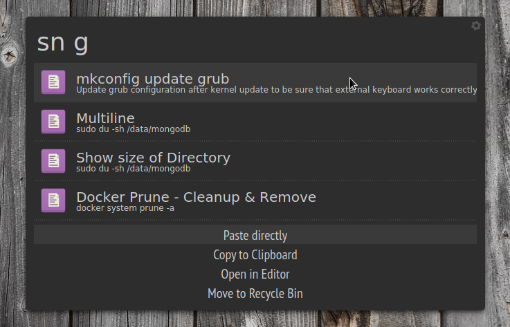

# Snippet Store
Extension for [Albert Launcher](https://albertlauncher.github.io/), used to store and retrieve code-snippets or other texts

I coded this, because I like Albert and use it a lot, and I didn't find a nice software for easy access to code snippets stored as plain text files on my drive.
(IMHO plaintext files has the advantages over DBs or json/xml, that they are easier to sync e.g. with cloud and also accessible/readable without additional applications.)



## Features
- Triggered by "sn"
- Uses a directory with plain-text files as source
- Search for text in those snippet-files
- Rank results based on number, position and sourroundings of occurrences
- Actions:
   - Copy to clipboard (default)
   - Open in associated application
   - Move to Trash bin
   - Open Snippet-Folder ("sn" without searchterm)

## Dependencies
- [Send2Trash](https://pypi.python.org/pypi/Send2Trash): `pip install Send2Trash`

## Manual installation
Download [Snippet Store.py](https://github.com/dynobo/snippet_store/blob/master/Snippet%20Store.py) to one of Albert Launchers folders for python extensions:
-  ~/.local/share/albert/org.albert.extension.python/modules
- /usr/local/share/albert/org.albert.extension.python/modules
- /usr/share/albert/org.albert.extension.python/modules

Adjust the configuration, which is currently hard coded:
- `SNIPPET_PATH = '/home/holger/cumulus/Notes/snippets'` - Folder, where your snippet files are stored
- `RECURSIVE = True` - Shall snippet folder be indexed recursively?
- `SNIPPET_EXT = 'md'` - File extension of your snippet files
- `iconPath = iconLookup('gedit')` - Icon file to be shown in Albert

Activate in Albert:
- Open Albert Launcher's Settings
- Go to "Extensions"
- Make sure the "Python"-Extension is activated
- In the Python Extension settings, activate "Snippet Store"

## Snippets
The first line of the snippet is always used as "Text" for Albert's results list. If the first line starts with '>', this char is stripped.

The second line of the snippet is always used as "Subtext" for Albert's results list. If the first line starts with '>', this char is stripped.

All text below 2nd line goes into the snippet and will be copied to clipboard.

However, **if** the second line starts with a '>', all text below the **3rd** line will be copied to clipboard.

##### Examples:
```
> mkconfig update grub
> Update grub configuration after kernel update to be sure that external keyboard works correctly.
sudo grub-mkconfig -o /boot/grub/grub.cfg
```

```
> Show size of Directory
sudo du -sh /data/mongodb
```

For the results, see Screenshot above.

## Todo
Not sure if I ever do this, as I'm fine with the current state. But maybe if requested or of interest by others:
- Create new snippet from clipboard
- Move configuration out of source (not sure to where...)
- Test performance for many snippets
